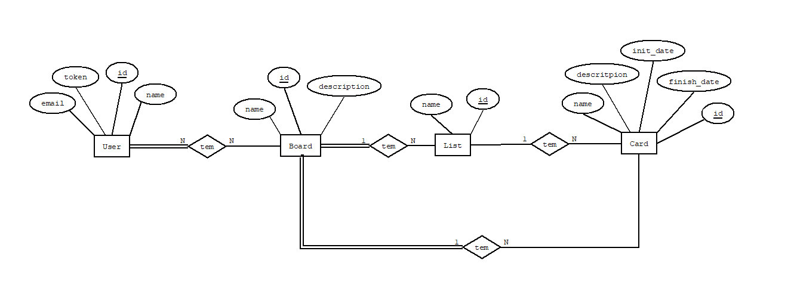
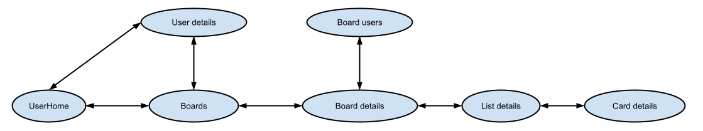
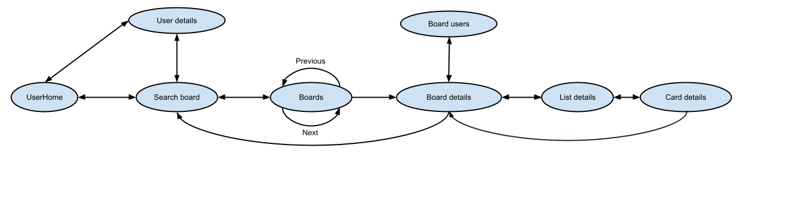

## Introduction

This document contains the relevant design and implementation aspects of our project.

## Modeling the database

### Conceptual model ###

The following diagram holds the Entity-Relationship model for the information managed by the system.

We highlight the following aspects:

We designed the ER diagram to capture the main entities and their relationships in the system. The diagram includes the following entities: User, Board, List, and Card.

One of the relevant design issues in this conceptual model is the relationship between the Board and the User entities. In our design, we have a many-to-many relationship, where a user can belong to multiple boards, and a board can have multiple users. This allows for flexibility in managing access to boards and users.

Another important design issue is the relationship between Lists and Cards entities. In our model, we have a one-to-many relationship, where a list can have multiple cards, but a card can belong to only one list. This simplifies the organization of tasks and helps to maintain a clear hierarchy of information.

The conceptual model has the following restrictions:

A User email and token must be unique; A Board name must be unique; A List name must be unique in the board; 

    
### Physical Model ###

The physical model of the database is available in [SQL Schema](../src/main/sql/createSchema.sql).

We highlight the following aspects of this model:

There are five tables: users, boards, taskLists, cards, and userBoards.

The "users" table has a unique email and token for each user.

The "boards" table has a unique name and a non-null description.

The "taskLists" table has a non-null name and a boolean flag indicating whether it is archived or not.

The "cards" table has a non-null name, description, initDate, and finishDate (defaulted to 9999-12-31).

The "userBoards" table creates a many-to-many relationship between users and boards.

## Software organization

### Open-API Specification ###

[Open-API Specification](task-management-api-spec.yaml)

In our Open-API specification, we highlight the following aspects:

Each entity has it's own path:
/users, /boards, /lists, /cards.

When more information is needed for a request, for example POST boards/boardID/users, that information must come in the request body.

### Request Details

A request arrives in the TasksServer module, which currently only routes it to the TasksWebApi module.
The TasksWebApi module then routes the request into 1 of 4 possible routes: users, boards, lists, or cards. With each of those options having their own module, named {Entity}Routes.
The Module for an entity, for example UsersRoutes, then extracts the relevant information from the request and passes it on to the TasksServices module.

The TasksServices module results from the aggregation of 4 different services concerning:UserServices, BoardServices, ListServices and CardServices.

For actions that require user board access, for example getting all the boards belonging to a user, the TaskServices modules will check if the user has to appropriate access and,
in case the user doesn't have the appropriate access the TaskServices module will throw and exception ( more on **Error Handling/Processing** ).
If the user has the appropriate access, an appropriate request is made to the TaskDataMem.

During resource(user/board/list..etc) creation in case of invalid input, such as invalid email for user creation, a error will also be thrown.

When a request is received by the TasksDataMem, it performs the requested function such as adding, updating a user/board/list/card in the in-memory data.

When the relevant information arrives back to the {Entity}Routes, then the Response is made and sent back to the TasksServer, which delivers it to it's consumer.

### Connection Management

Currently, we are using a simple connection to the database by utilizing the PGSimpleDataSource connection.

### Data Access

For data access we have two ways to do it:

The TasksDataPostgres class, an implementation of the AppDatabase interface that interacts with a PostgreSQL database to perform create, read and update operations, for that we use an instance of PGSimpleDataSource to connect to a PostgreSQL database.

The TasksDataMem class, an implementation of the AppDatabase interface that interacts with a in-memory data to perform create, read and update operations.

These classes have various methods that perform different operations such as createUser, getUserDetails, getUsersFromBoard, createBoard, getBoardDetails, addUserToBoard, getBoardsFromUser, etc...

### Error Handling/Processing

Any module under the TasksWebApi (or more specifically, it's {Entity}Routes) should throw an Exception when some type of problem is found, that results in the request not being fufilled.
That exception is then handled in the TasksWebApi, which captures the Exception and returns an Error Response to the server module, containing the correct information about the Exception that was thrown.

### Single Page Application (SPA)

There is a web application associated with the developed API. There is a single html page that is sent to the client, as well as other static-content, such as the javascript necessary to handle the SPA.
Each time a user attempts to change into a different section of the page, instead of another GET request being sent and a new html page being returned, the URI Fragment is changed. The client-side javascript detects this change and proceeds to send a request to the API, then changing the displayed html page depending on the request/response.

The following navegation graph shows how each "page" of the SPA is connected:

To support this navegation graph some changes where made to the domain,the most important being that,
a board now contains all the list belonging to it and a list now contains all the cards belonging to it.
Because of this we now have a SimpleList and a TaskList aswell as a Board and a SimpleBoard.
SimpleList and SimpleBoard objects are stored within the data module and TaskLists and Boards are created in the services module.

For phase 3 delivery the following navigation graph show the inter-page connetion:

In phase 3, we refactored the project to have dedicated directories for the DSL, views (the nodes in the graph), 
and partials (repeating elements in each view).

## Critical Evaluation

We realized the need to upgrade our database connection to better support transactions. In the next phase, we will implement 
the necessary changes.

In hindsight, when starting to develop the SPA, we should have created a partials directory from the beginning to avoid 
excessively cluttered code.
Due to the time constraints for the delivery, we will implement this in the following phase.

