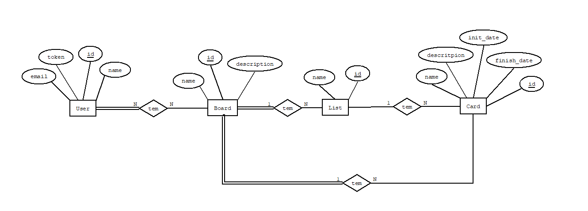

# Phase 1 

## Introduction

This document contains the relevant design and implementation aspects of LS project's first phase.

## Modeling the database

### Conceptual model ###

The following diagram holds the Entity-Relationship model for the information managed by the system.

We highlight the following aspects:

We designed the ER diagram to capture the main entities and their relationships in the system. The diagram includes the following entities: User, Board, List, and Card.

One of the relevant design issues in this conceptual model is the relationship between the Board and the User entities. In our design, we have a many-to-many relationship, where a user can belong to multiple boards, and a board can have multiple users. This allows for flexibility in managing access to boards and users.

Another important design issue is the relationship between Lists and Cards entities. In our model, we have a one-to-many relationship, where a list can have multiple cards, but a card can belong to only one list. This simplifies the organization of tasks and helps to maintain a clear hierarchy of information.

The conceptual model has the following restrictions:

A User email and token must be unique; A Board name must be unique; A List name must be unique in the board; 

    
### Physical Model ###

The physical model of the database is available in [SQL Schema](../src/main/sql/createSchema.sql).

We highlight the following aspects of this model:

There are five tables: users, boards, taskLists, cards, and userBoards.

The "users" table has a unique email and token for each user.

The "boards" table has a unique name and a non-null description.

The "taskLists" table has a non-null name and a boolean flag indicating whether it is archived or not.

The "cards" table has a non-null name, description, initDate, and finishDate (defaulted to 9999-12-31).

The "userBoards" table creates a many-to-many relationship between users and boards.

## Software organization

### Open-API Specification ###

[Open-API Specification](task-management-api-spec.yaml)

In our Open-API specification, we highlight the following aspects:

Each entity has it's own path:
/users, /boards, /lists, /cards.

When more information is needed for a request, for example POST boards/boardID/users, that information must come in the request body.

### Request Details

A request arrives in the TasksServer module, which currently only routes it to the TasksWebApi module.
The TasksWebApi module then routes the request into 1 of 4 possible routes: users, boards, lists, or cards. With each of those options having their own module, named {Entity}Routes.
The Module for an entity, for example UsersRoutes, then extracts the relevant information from the request and passes it on to the TasksServices module.

(_Inserir informação do TasksServices)

When a request is received by the TasksDataMem, it performs the requested function such as adding, updating a user/board/list/card in the in-memory data.

When the relevant information arrives back to the {Entity}Routes, then the Response is made and sent back to the TasksServer, which delivers it to it's consumer.

(_describe how a request goes through the different elements of your solution_)

(_describe the relevant classes/functions used internally in a request_)

(_describe how and where request parameters are validated_)

### Connection Management

(_describe how connections are created, used and disposed_, namely its relation with transaction scopes).

### Data Access

For data access we have two ways to do it:

The TasksDataPostgres class, an implementation of the AppDatabase interface that interacts with a PostgreSQL database to perform create, read and update operations, for that we use an instance of PGSimpleDataSource to connect to a PostgreSQL database.

The TasksDataMem class, an implementation of the AppDatabase interface that interacts with a in-memory data to perform create, read and update operations.

These classes have various methods that perform different operations such as createUser, getUserDetails, getUsersFromBoard, createBoard, getBoardDetails, addUserToBoard, getBoardsFromUser, etc...

### Error Handling/Processing

Any module under the TasksWebApi (or more specifically, it's {Entity}Routes) should throw an Exception when some type of problem is found, that results in the request not being fufilled.
That exception is then handled in the TasksWebApi, which captures the Exception and returns an Error Response to the server module, containing the correct information about the Exception that was thrown.
(_describe how errors are handled and their effects on the application behavior_).

## Critical Evaluation

(_enumerate the functionality that is not concluded and the identified defects_)

(_identify improvements to be made on the next phase_)
